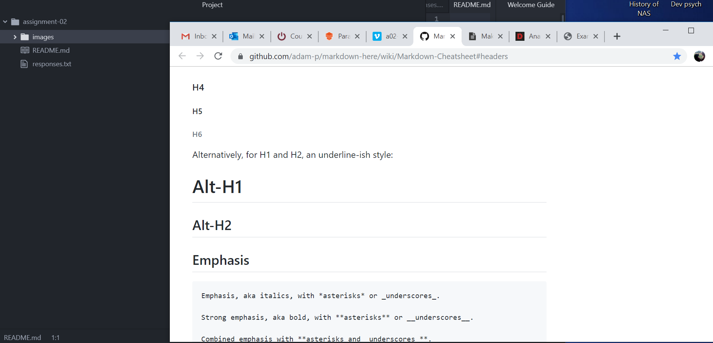

# Assignment-02
## Anna Lane

I decided to take a web development class to get a jump start on interacting with a job market that seems to want employees who have at least a little knowledge of code.  One of my best friends is getting her masters degree in computer programming and she encouraged me to start taking any class I could that would boost my knowledge of web-design/development.  Ten years ago I thought I was pretty computer savvy but somewhere along the line I became somewhat of a luddite.  Taking classes online has made me realize that I am behind and I would like to correct that.

1. I had suspected that there were under-sea cables connecting our digital world, but getting to watch the TedTalk was awesome!
2. I hope to learn enough about web-development to create a website for my own future business.
3. I hope that the work I do in this class can be included in a portfolio or a resume to help me find a "big kid job" in the future.

[Moodle Log-In](http://umonline.umt.edu/)

[My Responses](./responses.txt)

