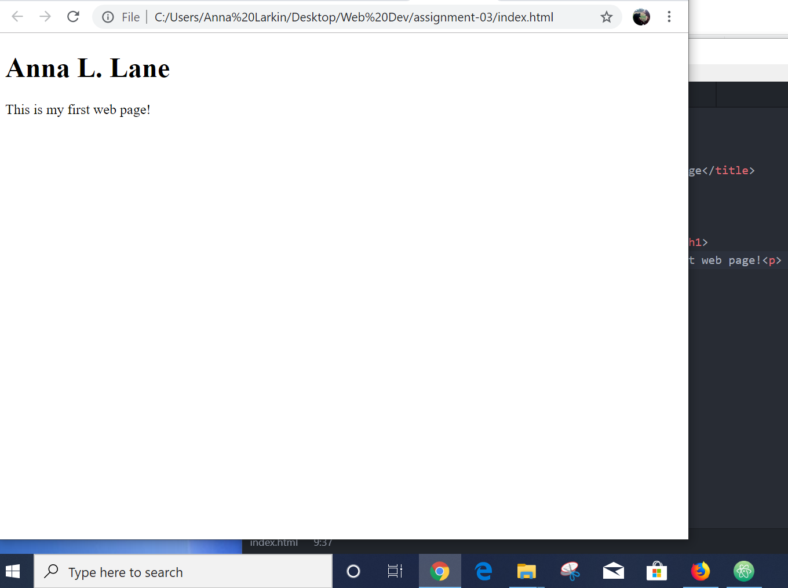

# Assignment-03
## Anna Lane

1. Web browsers are a software needed to access information on the World Wide Web.
Browsers find, access and display content on your personal computer. I use Google Chrome, but I also have Firefox and Internet Explorer on my PC.

2. Markup is a type language used to develop websites. A markup language is comprised of "tags" that create proper structure and different elements to a page.  Html is a markup language and the tags are made up of <> enclosures. For instance a letter "p" surrouded by <> and another "p" surround by </> creates a paragraph. I can type these in this README file because I am using Markdown, a software tool that converts my text in to html.

3. 
