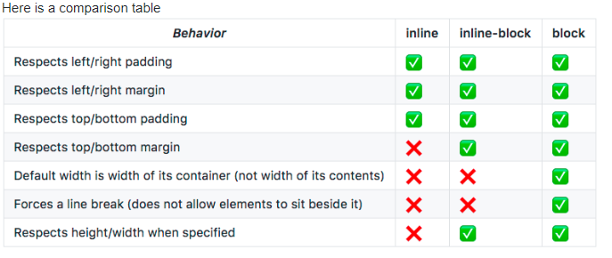

  My "clients" were lavender farmers who need volunteers.. work-trade... and customers to help them know what types of products are most popular.

Well, I wish I would have found this table before hand...I had a terrible time with this, and I know I made mistakes.  But I think I got it all to function alright and I hope I learned a lot.

  From: Niko Bellic
  https://stackoverflow.com/questions/3099030/displayinline-vs-displayblock

Also finding a real struggle with color.  I think it's my personal monitor sometimes, but using the color picker or pallets from the W3schools has been pretty disappointing off and on.  I have been trying to use colors properly and I think I generally have a good eye, but when I get them up into github they always seem a bit "off".
